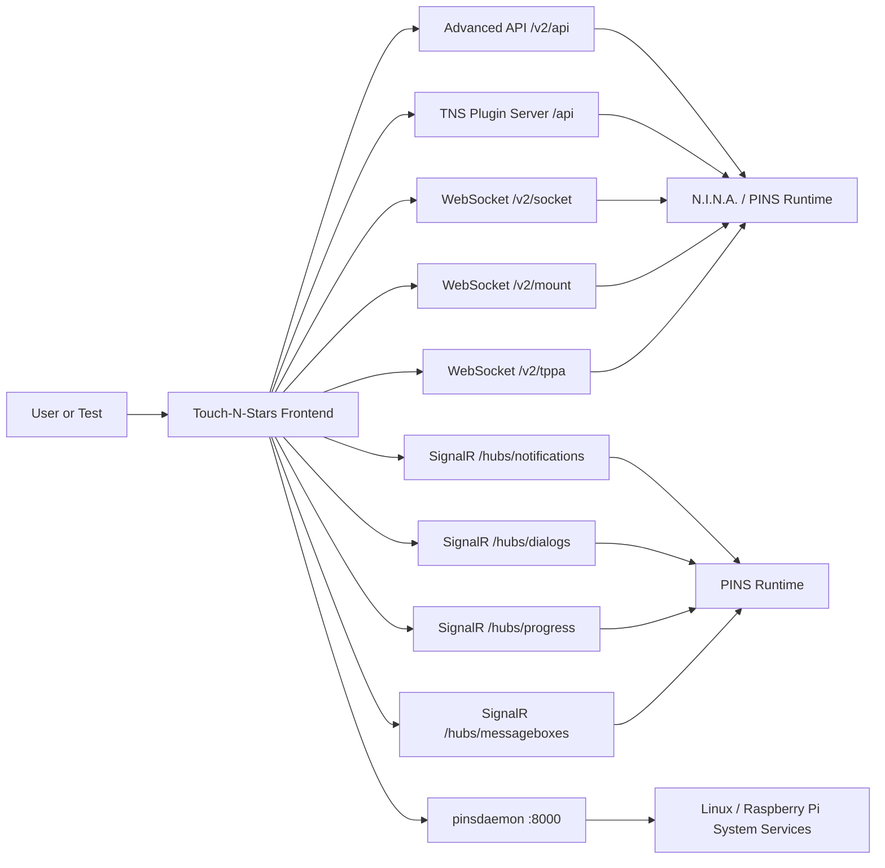

# Gemini Styleguide for Touch-N-Stars

## Purpose

This document teaches Gemini how to reason about, review, test, and modify the Touch-N-Stars project.

Touch-N-Stars is not a generic Vue application. It is a frontend control plane for astrophotography systems based on N.I.N.A., PINS, the Touch-N-Stars N.I.N.A. plugin server, the Advanced API plugin for N.I.N.A., SignalR channels, WebSockets, and the PINS system daemon.

Gemini must treat this repository as hardware-adjacent and system-adjacent software. Some actions can move real astronomical equipment, start exposures, alter system configuration, or change Raspberry Pi services. Code changes, tests, mocks, and documentation must therefore be conservative, backend-aware, platform-aware, and safety-aware.

---

## Project Ecosystem

### Touch-N-Stars

Repository:

```text
https://github.com/Touch-N-Stars/Touch-N-Stars
```

Touch-N-Stars is a Vue 3 and Capacitor-based frontend for remotely controlling N.I.N.A.-based astrophotography setups from browsers, tablets, phones, and embedded displays.

Touch-N-Stars is primarily a user interface and orchestration layer. It does not replace N.I.N.A.’s sequencing, device control, imaging, plate solving, guiding, or profile logic. It presents those capabilities through a mobile-friendly frontend and communicates with backend services that expose N.I.N.A. and PINS functionality.

Gemini must reason about Touch-N-Stars as a multi-runtime, multi-transport application, not as a single-page app connected to one REST backend.

---

### N.I.N.A.

N.I.N.A. stands for Nighttime Imaging ‘N’ Astronomy.

It is astrophotography automation software used to control and coordinate:

```text
Cameras
Mounts
Focusers
Filter wheels
Rotators
Flat panels
Dome devices
Weather devices
Safety monitors
Guiding software
Plate solving
Framing
Sequencing
Autofocus
Image capture
Image history
Profiles
Plugins
```

Touch-N-Stars remotely controls N.I.N.A. and must preserve N.I.N.A.’s state model.

Important N.I.N.A. concepts Gemini must understand:

```text
Profiles
Equipment connection state
Sequences
Targets
Camera exposure state
Mount slewing
Mount parking
Mount tracking
Guiding
Dithering
Autofocus
Plate solving
Framing Assistant
Filter changes
Rotator angle
Flat panel brightness
Weather and safety state
Image statistics
Three Point Polar Alignment / TPPA
```

N.I.N.A. operations are highly state-dependent. Many operations are only valid when equipment is connected, not parked, not currently exposing, not already slewing, not already sequencing, and not in a safety-restricted state.

Gemini must not assume that an API call can always be issued safely.

---

### ninaAPI / Advanced API Plugin

Repository:

```text
https://github.com/christian-photo/ninaAPI
```

`ninaAPI` is the Advanced API plugin for N.I.N.A.

It exposes N.I.N.A. functionality through HTTP and WebSocket interfaces.

Typical Advanced API base URL:

```text
http://localhost:1888/v2/api
```

Typical WebSocket base:

```text
ws://localhost:1888/v2
```

Touch-N-Stars uses this API for backend-aware control of N.I.N.A. devices and state.

Common Advanced API response envelope:

```json
{
  "Response": {},
  "Error": "",
  "StatusCode": 200,
  "Success": true,
  "Type": "API"
}
```

Common endpoint areas include:

```text
/version
/application/*
/equipment/camera/*
/equipment/mount/*
/equipment/filterwheel/*
/equipment/focuser/*
/equipment/rotator/*
/equipment/flatdevice/*
/equipment/weather/*
/equipment/safetymonitor/*
/sequence/*
/image/*
/profile/*
/framing/*
/guider/*
/plugin/*
```

Common WebSocket channels include:

```text
/v2/socket
/v2/mount
/v2/tppa
/v2/filterwheel
/v2/rotator
```

Common WebSocket events may include:

```text
IMAGE-PREPARED
IMAGE-SAVE
SEQUENCE-STARTING
SEQUENCE-FINISHED
SEQUENCE-PAUSED
SEQUENCE-RESUMED
SEQUENCE-STOPPED
AUTOFOCUS-STARTED
AUTOFOCUS-FINISHED
STACK-UPDATED
CAMERA-CONNECTED
CAMERA-DISCONNECTED
MOUNT-CONNECTED
MOUNT-DISCONNECTED
FILTERWHEEL-CONNECTED
FILTERWHEEL-DISCONNECTED
```

Gemini must not invent Advanced API behavior. When changing integration code, check the expected response envelope, error state, and whether the endpoint is synchronous, asynchronous, or WebSocket-driven.

Gemini must also be aware that public Advanced API documentation and repository changelogs may not always be at the same version. When reviewing or changing integration behavior, compare documentation, changelog, and the actual project code.

---

### pinsdaemon

Repository:

```text
https://github.com/Touch-N-Stars/pinsdaemon
```

`pinsdaemon` is a lightweight system daemon used in PINS environments, especially Raspberry Pi based setups.

It exposes system-level functionality over HTTP, usually on port `8000`.

Typical base URL:

```text
http://<host>:8000
```

It handles operations such as:

```text
System time
System temperature
System upgrades
Firmware upload
Samba configuration
PHD2 service control
Wi-Fi configuration
Diagnostics archive generation
Package update checks
INDI third-party package installation
Job status
Job logs over WebSocket
```

Many daemon operations are system-mutating. Gemini must treat these as dangerous by default.

Mutating daemon endpoints must not be used in normal PR tests or generated examples unless explicitly requested and isolated to a safe lab environment.

Dangerous examples:

```text
POST /upgrade
POST /firmware/upload
POST /wifi/connect
POST /wifi/disable
POST /packages/indi3rdparty/install
```

Read-only or safer examples:

```text
GET /system/time
GET /system/temperature
GET /updates/check
GET /phd2
GET /jobs/{jobId}
```

The daemon uses Bearer-token authentication.

Gemini must not hardcode real secrets into tests, documentation, or source code. Use environment variables for tokens.

Recommended variable:

```text
GEMINI_PINS_TOKEN
```

---

### PINS Fork

Repository:

```text
https://github.com/nitr57/pins
```

PINS is a Linux / Raspberry Pi oriented fork or adaptation of N.I.N.A.

Touch-N-Stars must support this environment as well as standard N.I.N.A. environments.

Gemini must understand that PINS is not only a frontend mode. It affects runtime behavior, available APIs, additional system services, SignalR communication, plugin availability, deployment expectations, and platform constraints.

PINS environments may include:

```text
Linux
Raspberry Pi
Headless or semi-headless execution
N.I.N.A.-derived runtime
Native dependencies
INDI integration
PHD2 integration
System services
Local network control
Daemon-backed management
```

Gemini must avoid assuming Windows-only paths or behaviors when modifying code intended to work with PINS.

---

## Runtime Modes

Touch-N-Stars has three important runtime modes.

### 1. Standard N.I.N.A. Mode

This mode talks to a normal N.I.N.A. installation using the Touch-N-Stars plugin server and the Advanced API plugin.

Expected communication channels:

```text
Touch-N-Stars frontend
    -> Touch-N-Stars plugin server /api/*
    -> Advanced API /v2/api/*
    -> Advanced API WebSocket /v2/socket
```

Use this mode for normal Windows N.I.N.A. installations.

---

### 2. PINS Mode

This mode includes everything from standard N.I.N.A. mode plus PINS-specific communication.

Additional communication channels may include:

```text
SignalR hubs
pinsdaemon on port 8000
PINS-specific plugin routes
PINS-specific device views
System status endpoints
PHD2 and INDI related endpoints
```

Typical SignalR hubs:

```text
/hubs/notifications
/hubs/dialogs
/hubs/progress
/hubs/messageboxes
```

Use this mode for PINS and Raspberry Pi oriented workflows.

---

### 3. UI Mock Mode

This is a local frontend-only mode for layout, shell, navigation, and demo behavior.

Important rule:

```text
UI mock mode is not enough for PINS or plugin integration testing.
```

In mock mode, plugin loading may intentionally be skipped. Therefore, Gemini must not use UI mock mode to validate PINS plugin behavior, real backend handshakes, Advanced API contracts, WebSocket behavior, SignalR behavior, or daemon behavior.

---

## Backend Handshake Contract

Gemini must understand the real connection sequence.

A backend-aware test or integration change must respect this handshake:

```text
1. Connect to the Touch-N-Stars plugin server
2. GET /api/version
3. GET /api/get-api-port
4. Use the returned dynamic Advanced API port
5. GET /v2/api/version
6. Detect whether PINS features are available
7. Connect to /v2/socket
8. In PINS mode, connect to SignalR hubs
9. In PINS mode, query pinsdaemon on port 8000 where needed
```

Do not assume that Advanced API is always on a fixed port.

Do not assume that PINS mode is active just because the frontend is running.

Do not assume that a failed PINS endpoint means the whole app is offline. Some missing PINS endpoints can simply mean the user is running standard N.I.N.A.

---

## Communication Architecture



---

## Plugin System Rules

Touch-N-Stars supports dynamic plugins.

Plugin routes may be assigned dynamically, for example:

```text
/plugin1
/plugin2
/plugin3
```

Gemini must never assume that `/plugin1` always means a specific plugin.

Bad:

```js
await page.goto('/plugin1');
```

Good:

```js
await page.getByTestId('plugin-nav-pins').click();
```

Better:

```html
<button data-plugin-id="pins" data-testid="plugin-nav-pins">
```

Gemini should prefer stable plugin identity over route order.

Recommended stable plugin identifiers:

```text
pins
pinsDevices
```

Recommended selectors:

```text
data-testid
data-plugin-id
ARIA role
Stable semantic labels
```

Avoid:

```text
Ordinal plugin routes
Long CSS chains
Translated text as the primary selector
Implicit element order
Timing-only waits
```

---

## Testing Strategy

Gemini should use a three-layer testing model.

### 1. UI Mock Tests

Use for:

```text
Application shell
Basic navigation chrome
Responsive layout
Translations
Theme behavior
Static rendering
Offline demo behavior
```

Do not use for:

```text
PINS plugin behavior
Advanced API behavior
WebSocket behavior
SignalR behavior
pinsdaemon behavior
Real connection lifecycle
```

---

### 2. Contract Mock Tests

Use for:

```text
Backend handshake
Dynamic Advanced API port handling
Plugin loading
PINS mode detection
REST response envelopes
WebSocket events
SignalR messages
pinsdaemon responses
Error states
Reconnect behavior
```

This is the preferred layer for Gemini-generated integration and visual regression tests.

Contract mocks should model the real communication shape without touching real hardware.

---

### 3. Live Smoke Tests

Use only for:

```text
Simulator-backed N.I.N.A.
Dedicated lab PINS hosts
Safe read-only endpoints
Carefully gated manual workflows
```

Never run live smoke tests against real production equipment in default PR CI.

Never run system-mutating daemon operations in default PR CI.

---

## Recommended Test Matrix

| Scenario | Mode | Backend | Purpose |
|---|---|---|---|
| App starts without backend | UI mock | Mock | Validate shell and fallback UI |
| Standard N.I.N.A. handshake | Contract mock | Mock | Validate `/api/version`, dynamic API port, `/v2/api/version`, websocket |
| PINS handshake | Contract mock | Mock | Validate SignalR, pinsdaemon, PINS plugin visibility |
| Plugin navigation | Contract mock | Mock | Validate plugin identity without relying on `/pluginN` |
| Sequence state UI | Contract mock | Mock | Validate sequence display and event updates |
| Image history UI | Contract mock | Mock | Validate image events and rendered history |
| Camera exposing error | Contract mock | Mock | Validate Advanced API `409` handling |
| Mount parked error | Contract mock | Mock | Validate mount safety state handling |
| pinsdaemon auth error | Contract mock | Mock | Validate `401` handling |
| Simulator smoke | Live smoke | Safe live | Validate real contract against simulator only |

---

## Safety Rules

Gemini must treat this project as hardware-adjacent and system-adjacent.

The app may control or influence:

```text
Camera exposures
Mount movement
Mount parking
Tracking
Guiding
Autofocus
Rotator movement
Flat panel brightness
Dome state
Sequence execution
PHD2 service state
Wi-Fi configuration
System updates
Firmware installation
Package installation
```

Gemini must not casually generate code or tests that trigger real-world movement or destructive system changes.

### Dangerous Operations

Do not include these in default automated tests:

```text
Mount slew
Mount park / unpark
Long camera exposure
Sequence start on real hardware
Firmware upload
System upgrade
Wi-Fi reconfiguration
Package installation
Service restart on a real host
```

These operations require explicit user intent and a safe lab environment.

### Safer Operations

These are generally safer for contract mocks or controlled live smoke tests:

```text
Version check
Profile read
Equipment info read
System time read
System temperature read
Update check
Readonly status query
Simulated websocket event
Mocked SignalR dialog
Mocked job status
```

---

## Advanced API Error Handling

Gemini must model N.I.N.A. and Advanced API errors as normal domain states, not exceptional edge cases.

Common examples:

```text
Camera not connected
Camera already exposing
Mount not connected
Mount parked
Mount already slewing
Sequencer not initialized
Profile unavailable
Guider not connected
Plate solve failed
Safety monitor unsafe
Weather source unavailable
```

HTTP `409` often means the requested operation is invalid in the current equipment state.

Gemini should not “fix” such cases by blindly retrying the same action. The UI should explain the state and guide the user toward a valid action.

---

## WebSocket Rules

Gemini must understand that Touch-N-Stars is event-driven.

The app may receive asynchronous events for:

```text
Image saved
Sequence started
Sequence finished
Autofocus started
Autofocus finished
Mount connected
Camera disconnected
Stack updated
TPPA status changed
```

Tests must wait for visible state changes or specific events, not arbitrary sleep delays.

Bad:

```js
await page.waitForTimeout(5000);
```

Good:

```js
await expect(page.getByTestId('sequence-status-badge')).toHaveAttribute('data-state', 'running');
```

For mount websocket commands, Gemini must understand that live control may require repeated commands or heartbeats. Do not generate simplistic live mount-control tests unless explicitly requested and simulator-backed.

---

## SignalR Rules

In PINS mode, Touch-N-Stars may communicate through SignalR hubs.

Common hub categories:

```text
Notifications
Dialogs
Progress
Messageboxes
```

Gemini must treat these as part of the application contract.

Contract tests should cover:

```text
Notification received
Dialog opened
Dialog answered
Progress updated
Messagebox displayed
Reconnect after disconnect
Backend loss cleanup
```

SignalR tests must not depend on arbitrary timing. They should wait for UI state caused by the mocked hub message.

---

## pinsdaemon Rules

Gemini must separate `pinsdaemon` from N.I.N.A. Advanced API.

Advanced API controls N.I.N.A. functionality.

`pinsdaemon` controls system-level PINS functionality.

This distinction matters because daemon endpoints may change the host system.

Recommended environment variables:

```text
GEMINI_PINSDAEMON_URL
GEMINI_PINS_TOKEN
```

Do not hardcode daemon tokens in generated tests.

Do not commit real tokens.

Use mock tokens in examples:

```text
test-token
dummy-token
example-token
```

---

## Visual Regression Policy

Gemini should use visual tests carefully.

Astrophotography UIs contain dynamic content:

```text
Timestamps
Live images
Histograms
Progress bars
Temperature values
Exposure counters
Sequence timers
Guiding graphs
Star counts
HFR values
Network status
```

These regions should usually be masked or stabilized.

Recommended visual test rules:

```text
Use one canonical desktop viewport
Use one canonical mobile viewport
Freeze locale
Freeze timezone
Freeze clock where possible
Mask dynamic image regions
Mask timestamps
Mask progress counters
Mask charts and live plots
Use deterministic fixtures
Avoid screenshots of uncontrolled live streams
```

Recommended screenshot naming:

```text
<area>.<state>.<mode>.<locale>.<viewport>.png
```

Examples:

```text
connection.connected.contract.en.desktop.png
pins-dashboard.ready.contract.en.desktop.png
sequence.running.contract.en.mobile.png
camera.error-exposing.contract.en.desktop.png
```

---

## Recommended Test IDs

Gemini should prefer or add stable test IDs for important application regions.

Recommended IDs:

```text
connection-splash
backend-status-pill
instance-selector
plugin-nav-pins
plugin-nav-pinsDevices
plugin-page-pins
plugin-page-pinsDevices
pins-system-time-card
pins-temperature-card
pins-daemon-status
sequence-status-badge
sequence-start-button
sequence-stop-button
sequence-pause-button
camera-live-image
image-history-list
image-history-item
mount-control-pad
mount-park-button
mount-unpark-button
tppa-panel
messagebox-modal
dialog-panel
progress-panel
toast-list
notification-list
```

Do not use translated text as the only selector.

This project supports multiple languages, so text-based selectors can break when locale changes.

---

## Suggested Test Directory Layout

Browser, contract, and visual tests should not be mixed into existing unit-test folders.

Recommended layout:

```text
tests/
  gemini/
    e2e/
      ui-mock/
      contract/
      live-smoke/
    fixtures/
      advanced-api/
      websockets/
      signalr/
      pinsdaemon/
    baselines/
      desktop/
      mobile/
    support/
      backend-stub/
      selectors/
      test-helpers/
```

Existing Node/unit tests can remain under:

```text
src/**/__tests__/*.test.js
```

---

## Recommended Environment Variables

Existing or recommended variables for Gemini-aware testing:

```text
GEMINI_TEST_MODE=ui-mock|contract-mock|live-smoke
GEMINI_BASE_URL=http://127.0.0.1:4173
GEMINI_TNS_PLUGIN_URL=http://127.0.0.1:5000/api
GEMINI_NINA_API_URL=http://127.0.0.1:1888/v2/api
GEMINI_SIGNALR_BASE_URL=http://127.0.0.1:4782
GEMINI_PINSDAEMON_URL=http://127.0.0.1:8000
GEMINI_PINS_TOKEN=test-token
GEMINI_LOCALE=en
GEMINI_TIMEZONE=Europe/Berlin
GEMINI_VISUAL_UPDATE=false
GEMINI_DISABLE_UPDATER=true
```

Gemini must treat these as test configuration, not production configuration.

---

## Example Contract Test

```js
import { test, expect } from '@playwright/test';

test.use({
  locale: process.env.GEMINI_LOCALE || 'en-US',
  timezoneId: process.env.GEMINI_TIMEZONE || 'Europe/Berlin',
  viewport: { width: 1280, height: 800 },
});

test.beforeEach(async ({ context }) => {
  await context.addInitScript(() => {
    localStorage.setItem('USE_MOCK_API', 'false');
  });
});

test('renders the PINS dashboard after a full contract handshake', async ({ page }) => {
  await page.goto(process.env.GEMINI_BASE_URL || 'http://127.0.0.1:4173');

  await expect(page.getByTestId('connection-splash')).toBeHidden();
  await expect(page.getByTestId('backend-status-pill')).toHaveAttribute('data-state', 'connected');

  await page.getByTestId('plugin-nav-pins').click();

  await expect(page.getByTestId('plugin-page-pins')).toBeVisible();
  await expect(page.getByTestId('pins-system-time-card')).toBeVisible();
  await expect(page.getByTestId('pins-temperature-card')).toBeVisible();

  await expect(page).toHaveScreenshot('pins-dashboard.ready.contract.en.desktop.png', {
    maxDiffPixelRatio: 0.005,
    mask: [
      page.getByTestId('timestamp-label'),
      page.getByTestId('camera-live-image'),
    ],
  });
});
```

This is an example pattern. It assumes a browser test stack such as Playwright exists or is added.

---

## Example Advanced API Fixture

```json
{
  "Response": "2.2.15.1",
  "Error": "",
  "StatusCode": 200,
  "Success": true,
  "Type": "API"
}
```

Example WebSocket image event:

```json
{
  "Response": {
    "Event": "IMAGE-SAVE",
    "ImageStatistics": {
      "ExposureTime": 60,
      "Index": 12,
      "Filter": "Ha",
      "Temperature": -10,
      "Gain": 100,
      "Date": "2026-05-29T22:15:00+02:00",
      "Stars": 154,
      "HFR": 2.31,
      "TargetName": "M31",
      "Filename": "M31_Ha_0012.fits"
    }
  },
  "Error": "",
  "StatusCode": 200,
  "Success": true,
  "Type": "Socket"
}
```

Example pinsdaemon time fixture:

```json
{
  "timestamp": 1772219700,
  "iso": "2026-05-29T22:15:00+02:00"
}
```

---

## Coding Rules for Gemini

### General

Gemini should:

```text
Preserve the existing Vue 3 architecture
Use Pinia stores for shared state
Keep API access inside services
Avoid direct API calls from components
Keep components focused on UI
Keep domain logic outside templates
Preserve i18n support
Preserve mobile and desktop layouts
Preserve Capacitor compatibility
```

Gemini should not:

```text
Move backend calls into random components
Bypass existing stores
Hardcode localhost assumptions into production code
Hardcode plugin route order
Hardcode real tokens
Assume standard N.I.N.A. and PINS behave identically
Assume all users have all devices connected
Assume all API failures are fatal
```

---

## API Service Rules

Gemini must keep API integrations centralized.

Expected service responsibilities:

```text
Build base URLs
Handle dynamic API ports
Normalize response envelopes
Handle unavailable backend states
Handle PINS-specific fallbacks
Apply auth headers where needed
Avoid leaking daemon tokens
Expose stable domain methods to stores/components
```

Components should call stores or services, not construct raw URLs directly.

Bad:

```js
axios.get(`http://${host}:8000/system/time`);
```

Good:

```js
apiPinsService.getSystemTime();
```

---

## Store Rules

Stores should own application state such as:

```text
Connection status
Selected instance
Backend availability
N.I.N.A. version
PINS availability
Equipment state
Sequence state
Image history
Plugin availability
Daemon status
Dialog/message state
```

Stores should expose clear state flags for UI and tests:

```text
isConnected
isPins
isMockMode
isBackendReachable
isSequenceRunning
isCameraConnected
isMountConnected
isDaemonReachable
```

Avoid ambiguous boolean names.

Prefer domain-specific names.

---

## UI Rules

Touch-N-Stars is used in dark environments during astrophotography sessions.

Gemini must preserve:

```text
High contrast
Low-glare design
Mobile usability
Large tap targets
Readable status indicators
Minimal accidental destructive actions
Clear disabled states
Clear loading states
Clear error states
```

Dangerous actions should require clear intent.

Examples:

```text
Stop sequence
Park mount
Unpark mount
Start slew
Change Wi-Fi
Run upgrade
Upload firmware
Install packages
Restart services
```

---

## Internationalization Rules

The app is multilingual.

Gemini must:

```text
Use translation keys for user-facing text
Avoid hardcoded UI strings
Avoid text-only selectors in tests
Keep translation keys stable
Update all required locale files when adding new UI text
```

Tests should prefer `data-testid` instead of visible translated strings.

---

## Documentation Rules

When Gemini modifies backend-related behavior, it should update documentation or comments explaining:

```text
Which backend is involved
Which runtime mode is affected
Whether the operation is safe, read-only, or mutating
Whether the operation is mockable
Whether the operation needs simulator or live hardware
```

Do not duplicate full external API documentation in this repository. Instead, document the project-specific contract and assumptions.

---

## Review Rules for Gemini

When reviewing a PR, Gemini should check:

```text
Does this change affect standard N.I.N.A., PINS, or both?
Does it respect the backend handshake?
Does it handle dynamic Advanced API ports?
Does it avoid hardcoded plugin route order?
Does it avoid hardcoded real secrets?
Does it preserve mock mode?
Does it preserve contract-testability?
Does it avoid dangerous live operations in CI?
Does it handle disconnected equipment?
Does it handle N.I.N.A. domain errors?
Does it preserve mobile usability?
Does it preserve i18n?
Does it preserve Capacitor compatibility?
```

---

## CI Rules

Default PR CI should run:

```text
Unit tests
Lint/build checks
UI mock tests
Contract mock tests
Safe visual regression tests
```

Default PR CI should not run:

```text
Live mount movement
Live camera exposure
Live sequence execution
Firmware upload
System upgrade
Wi-Fi changes
Package installation
```

Live smoke tests should be manual, scheduled, or restricted to safe lab infrastructure.

---

## Suggested Commands

Existing commands should remain authoritative. If browser/visual testing is added, recommended commands are:

```json
{
  "test:gemini:ui-mock": "playwright test tests/gemini/e2e/ui-mock",
  "test:gemini:contract": "playwright test tests/gemini/e2e/contract",
  "test:gemini:live-smoke": "playwright test tests/gemini/e2e/live-smoke",
  "test:visual:ci": "playwright test tests/gemini/e2e --grep @visual",
  "test:visual:update": "playwright test tests/gemini/e2e --update-snapshots"
}
```

Only add these if the project adopts Playwright or an equivalent browser test runner.

---

## Merge Checklist

Before merging styleguide or Gemini-related testing changes, verify:

```text
The three runtime modes are documented.
The backend handshake is documented.
Dynamic Advanced API port handling is respected.
Plugin ordinal paths are not used in tests.
Stable selectors exist for PINS and plugin pages.
UI mock and contract mock are separated.
Live smoke tests are gated and safe.
pinsdaemon mutating operations are blocked from PR CI.
Advanced API 409 states are tested as domain states.
WebSocket and SignalR reconnect behavior is modeled.
Visual tests mask dynamic regions.
Locale, timezone, and clock are stabilized where possible.
Secrets are not hardcoded.
PINS/Linux assumptions are not broken by Windows-only changes.
Capacitor compatibility is preserved.
```

---

## Final Gemini Principle

Touch-N-Stars is a frontend for controlling real astrophotography systems.

Gemini must optimize for:

```text
Correctness
Safety
Backend realism
Hardware awareness
Stable selectors
Deterministic tests
Clear user feedback
No accidental destructive operations
```

Gemini must not simplify the project into a normal SPA with a single REST backend. It must reason about N.I.N.A., Advanced API, PINS, SignalR, WebSockets, plugin routing, daemon communication, and real-world equipment state.
