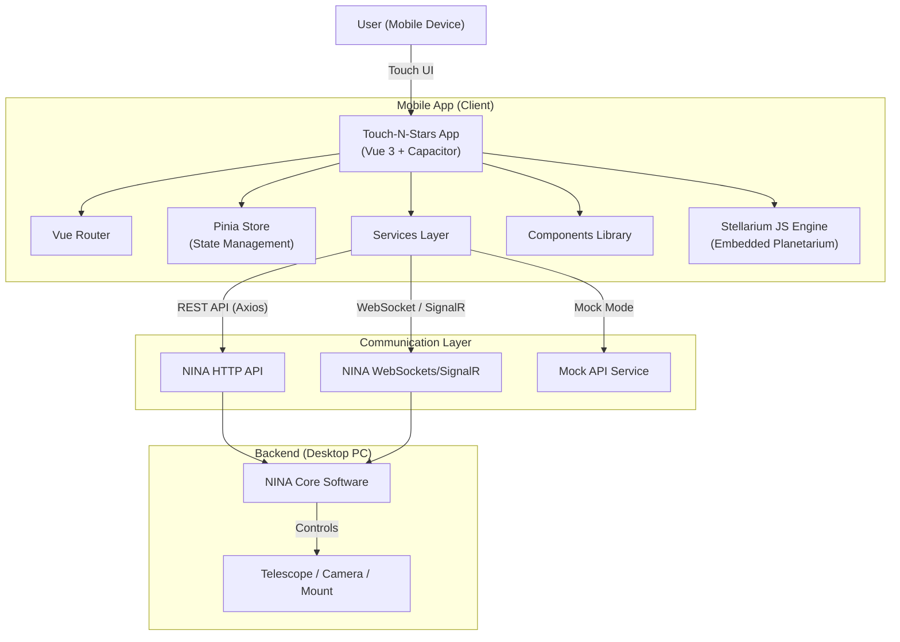

# Touch-N-Stars: High-Level Design (HLD)

## 1. System Overview

**Touch-N-Stars** is a cross-platform mobile interface for NINA (Nighttime Imaging 'N' Astronomy). It functions as a remote control client, communicating with a running NINA instance over a local network (Wi-Fi). It allows users to manage astronomical equipment, monitor imaging sessions, and perform complex tasks like polar alignment and framing from a mobile device.

### 1.1 Architecture Diagram (Conceptual)

## 2. Technology Stack

*   **Frontend Framework**: [Vue.js 3](https://vuejs.org/) (Composition API)
*   **Mobile Runtime**: [Capacitor 5](https://capacitorjs.com/) (Android & iOS)
*   **State Management**: [Pinia](https://pinia.vuejs.org/) (with persistence)
*   **UI/Styling**: [Tailwind CSS](https://tailwindcss.com/)
*   **Routing**: Vue Router
*   **Internationalization**: `vue-i18n`
*   **Visualizations**: `chart.js` (Histograms/Graphs), `stellarium-web-engine` (Sky Map)
*   **Communication**:
    *   `axios` (HTTP REST)
    *   `@microsoft/signalr` (Real-time events)
    *   Native WebSockets (High-frequency data)

## 3. Core Modules & Features

The application is modularized by astronomical function.

### 3.1 Imaging & Acquisition
*   **Camera Control**: Manual exposure, gain/offset, cooling management (`cameraStore`).
*   **Sequencer**: Monitoring and control of NINA's advanced sequencer (`sequenceStore`).
*   **Image History**: Review of captured images using `blob` management.
*   **Framing**: Import/Framing of targets, integration with the framing assistant.

### 3.2 Equipment Control
*   **Mount**: Slew controls, tracking toggle, parking (`mountStore`).
*   **Focuser**: Manual focus control, autofocus triggering (`autofocusStore`).
*   **Filter Wheel**: Filter selection and offset management (`filterStore`).
*   **Rotator**: Manual rotation and sync.
*   **Dome**: Shutter control, azimuth slaving.
*   **Switch**: Power/Outlet toggling.
*   **Flat Device**: Control of light panels for flat frames.

### 3.3 Advanced Tools
*   **Stellarium Integration**:
    *   Runs a local instance of **Stellarium Web Engine** inside a View.
    *   Allows "Slew to" functionality by tapping celestial objects.
    *   Displays current telescope position on the sky map.
*   **TPPA (Three Point Polar Alignment)**: 
    *   Dedicated wizard for polar alignment using NINA's solver.
    *   Visual feedback via WebSocket stream.
*   **Flat Assistant**: Wizard for calculating optimal exposure times for flat frames.

## 4. Architectural Layers

### 4.1 View Layer (`src/views`)
Represents the main screens. Each major equipment type or task has a dedicated page (e.g., `CameraPage.vue`, `MountPage.vue`).

### 4.2 Component Layer (`src/components`)
Reusable UI blocks.
*   **Functional Components**: `camera/`, `mount/`, `focuser/` contain the specific control widgets.
*   **Shared Components**: `NavigationComp.vue`, `SettingsComp.vue` for global UI elements.

### 4.3 State Management (`src/store`)
Uses **Pinia** stores to maintain app state.
*   **`store.js` (apiStore)**: Global state, connection status, device profiles.
*   **Feature Stores**: Independent stores (e.g., `cameraStore`, `guiderStore`) manage the logic for specific hardware. They persist state where appropriate (e.g., last used settings).

### 4.4 Service Layer (`src/services`)
Handles external communication.
*   **`apiService.js`**: The primary REST client. Adapts based on `apiStore` connection settings (protocol, IP, port).
*   **`mockApiService.js`**: A simulation layer that intercepts requests when `MOCK_MODE` is enabled, returning fake data for development/testing without NINA.
*   **`signalR...Service.js`**: Handles server-push events from NINA (e.g., "Exposure Finished", "Guider Stopped").
*   **`websocket...js`**: specialized low-latency connections for things like TPPA or Mount updates.

## 5. Deployment & Build Flow

*   **Web Build**: `npm run build` produces a standard static web app in `dist/`.
*   **Mobile Build**:
    *   `ionic:build` prepares the web assets.
    *   `npx cap sync` copies assets to `android/` and `ios/` native projects.
    *   Native IDEs (Android Studio / Xcode) handle the final compilation.
*   **Plugin Mode**: The app can also be built as a NINA desktop plugin via `npm run testbuild`, deploying directly into NINA's local AppData folder.

## 6. Key Data Flows

1.  **Initialization**:
    *   App starts → `main.js` initializes Pinia & Router.
    *   `apiStore` attempts to connect to configured NINA IP.
    *   On success, profiles (camera/telescope definitions) are fetched.

2.  **Command Execution**:
    *   User Taps "Expose" in `CameraPage`.
    *   `cameraStore.capturePhoto()` is called.
    *   `apiService.post('/capture/start', ...)` sends command to NINA.
    *   UI shows loading state.

3.  **Real-time Feedback**:
    *   SignalR / WebSocket receives "ImageSaved" event from NINA.
    *   App triggers an image download via `apiService`.
    *   Image is displayed to the user.
