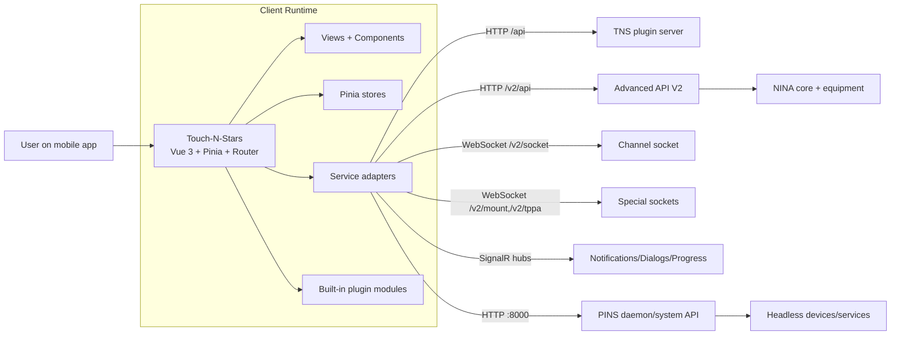

# Touch-N-Stars: High-Level Design (HLD)

## 1. Purpose and Scope

Touch-N-Stars is a Vue 3 + Capacitor client for remotely operating NINA-based astrophotography setups from phone and tablet devices. The app is designed as a control plane UI and does not replace NINA processing logic. It supports three runtime modes:

1. Normal NINA/WPF backend mode.
2. PINS/headless mode with additional daemon APIs and SignalR channels.
3. Local mock mode for UI and workflow testing without a backend.

This document describes the architecture as implemented in the current codebase (branch `develop`).

## 2. System Context

```mermaid
flowchart LR
  U[User on mobile app] --> APP[Touch-N-Stars\nVue 3 + Pinia + Router]

  subgraph Client Runtime
    APP --> VIEWS[Views + Components]
    APP --> STORES[Pinia stores]
    APP --> SERVICES[Service adapters]
    APP --> PLUGINS[Built-in plugin modules]
  end

  SERVICES -->|HTTP /api| TNS[TNS plugin server]
  SERVICES -->|HTTP /v2/api| ADV[Advanced API V2]
  SERVICES -->|WebSocket /v2/socket| WSCH[Channel socket]
  SERVICES -->|WebSocket /v2/mount,/v2/tppa| WSSP[Special sockets]
  SERVICES -->|SignalR hubs| SR[Notifications/Dialogs/Progress]
  SERVICES -->|HTTP :8000| PINS[PINS daemon/system API]

  ADV --> NINA[NINA core + equipment]
  PINS --> DEVICES[Headless devices/services]
```

## 3. Architecture Overview

### 3.1 Frontend Core

- Framework: Vue 3.5 (Composition API).
- Router: Vue Router 5 with setup guard and nav visibility guard.
- State: Pinia 3 with persisted state plugin.
- Styling: Tailwind CSS + component-local styles.
- i18n: vue-i18n with 12 shipped locales.
- Native shell: Capacitor 8 for Android and iOS.

### 3.2 High-Level Layering

1. Presentation: `src/views` and `src/components`.
2. Domain state: `src/store` and plugin-local stores under `src/plugins/*/store`.
3. Integration services: `src/services` (REST, SignalR, WebSockets, updater, mock).
4. Utilities and infrastructure: `src/utils`, scripts, static assets in `public`.

## 4. Startup and Lifecycle

### 4.1 Boot Sequence

`src/main.js` performs the startup flow:

1. Create app, Pinia, router, i18n, and head manager.
2. Register global tooltip directive.
3. Set global error handler and console capture.
4. Initialize plugin store with app/router references.
5. If mock mode is disabled, discover and initialize enabled plugins.
6. Mount app.
7. Notify Capacitor updater that app is ready.
8. Initialize time sync (best-effort).

### 4.2 Runtime Lifecycle

`src/App.vue` orchestrates app lifecycle:

- Connection splash and setup gating.
- Background/foreground pause/resume handling (web + Capacitor events).
- Update checks and update modal flow.
- Dialog/messagebox signaling mode switching for PINS vs non-PINS.
- Keep-awake initialization for mobile platforms.
- Whats-new modal from build-generated JSON.

## 5. Connectivity and Transport Model

### 5.1 Connection Handshake

`src/store/store.js` (`apiStore`) establishes backend reachability in stages:

1. Check TNS plugin availability via `/api/version`.
2. Resolve dynamic Advanced API port via `/api/get-api-port`.
3. Validate Advanced API V2 availability/version via `/v2/api/version`.
4. Detect PINS capability.
5. Connect channel WebSocket (`/v2/socket`) and subscribe to image events.
6. In PINS mode, connect notification SignalR hub.
7. Mark backend reachable only if all required checks pass.

### 5.2 Communication Channels

- REST (Axios): command-and-query operations for equipment, profiles, sequence, framing, guider, etc.
- Channel WebSocket: event stream and image-related subscriptions.
- Dedicated WebSockets: mount control and TPPA streams.
- SignalR services: notifications, progress, dialogs, message boxes.
- PINS daemon/system API on port 8000 for headless/system features.

### 5.3 Polling vs Push

- Core status refresh loop runs in `apiStore` every 2 seconds.
- Event history is rate-limited (15 second cadence) and used to infer device connectivity.
- Push channels are used where low-latency or asynchronous UX is needed.

## 6. State Management Design

### 6.1 Global Stores

- `store.js` (`apiStore`): backend state machine, equipment snapshot, connection orchestration, global reset behavior.
- `settingsStore.js`: persistent user/setup preferences, instance management, navbar configuration, language, feature flags.
- Additional feature stores: camera, mount, guider, sequence, framing, dialog, toast, image, progress, tppa, and more.

### 6.2 Persistence Strategy

- Pinia persisted state is used for settings and plugin state.
- Additional direct localStorage flags are used for setup/tutorial completion and mock mode toggles.
- On instance switch or backend loss, `apiStore.clearAllStates()` performs a broad cleanup across stores and disconnects transports.

## 7. Plugin Architecture

### 7.1 Discovery and Registry

- Plugin source folders are under `src/plugins/*`.
- `scripts/generate-plugin-registry.js` scans plugin folders (`index.js` + `plugin.json`) and generates `src/plugins/pluginRegistry.js`.
- Build scripts regenerate the registry before compile.

### 7.2 Runtime Loading

- `pluginStore` loads metadata and applies persisted user enablement.
- Enabled plugins are initialized during app boot.
- Plugin routes are injected through a router proxy that removes stale routes and enforces stable route names to avoid duplicates.
- Plugin navigation items are added dynamically and de-duplicated by plugin id.

### 7.3 Mock-Mode Interaction

- In mock mode (`localStorage.USE_MOCK_API === 'true'`), plugin loading is intentionally skipped to avoid stale/duplicated routes in offline demos.

## 8. Operational Modes

### 8.1 Standard NINA Mode

- Uses Advanced API V2 + TNS plugin server.
- Dialog updates use polling (non-PINS path).
- Equipment control and status polling are active.

### 8.2 PINS/Headless Mode

- Detected at runtime.
- Enables additional PINS services and overlays.
- Uses SignalR for dialogs/message boxes.
- Includes time mismatch warning/sync flow against PINS system API.

### 8.3 Mock Mode

- Enabled via localStorage flag.
- Uses `mockApiService` with deterministic simulated state.
- Skips WebSocket channel and plugin initialization.
- Intended for UI development, testing, and demos.

## 9. Feature Domain Map

### 9.1 Core Domains

- Equipment: camera, mount, focuser, guider, filter wheel, rotator, dome, switch, flat device, weather, safety.
- Imaging workflows: sequence monitoring/control, image history, stats and graphs.
- Setup and profiles: instance-based backend selection and active profile driven behavior.
- Targeting and planning: framing, favorites, Stellarium integration.
- Alignment and utilities: TPPA, flat assistant, plugin-specific workflows.

### 9.2 Cross-Cutting UX

- i18n localization across shipped locale packs.
- Toasts/modals/dialog systems.
- Orientation-aware layout behavior and route view refresh handling.
- Error capture and debug console support.

## 10. Build, Packaging, and Release

### 10.1 Build Pipeline

`package.json` scripts define:

1. Lint-first build discipline (`lint:eslint` integrated into build scripts).
2. Pre-build generation:
   - plugin registry generation.
   - whats-new JSON generation from `CHANGELOG.md`.
3. Web bundle output to `dist`.

### 10.2 Deployment Targets

- Web app deployment.
- Native packages via Capacitor projects (`android/`, `ios/`).
- NINA plugin test deployment path via `npm run testbuild`.

### 10.3 OTA Update Architecture

- Native OTA updates are managed via Capgo Capacitor Updater.
- Update metadata is sourced from GitHub releases.
- Channel selection is controlled by settings (`stable` vs `beta` behavior).
- Update application requires explicit user confirmation in the app modal flow.

## 11. Data and Assets

- `public/stellarium-data` and `public/stellarium-js` host heavy astronomy/visualization assets.
- `public/whats-new.json` is generated at build time.
- `src/locales/*.json` provide locale resources.

## 12. Key Runtime Flows

### 12.1 App Ready and Backend Connect

1. Boot app + initialize plugins (unless mock).
2. Run `fetchAllInfos` to validate backend stack and versions.
3. Connect sockets/hubs based on mode.
4. Begin periodic fetch loops and feature-specific background tasks.

### 12.2 Instance Switch

1. User selects instance in settings.
2. `settingsStore` updates active connection.
3. `apiStore.clearAllStates()` resets transport/store state.
4. Connect sequence restarts against the new backend.

### 12.3 Native Update Flow

1. App checks latest release metadata from GitHub API.
2. Compares normalized semantic versions.
3. Shows update modal when applicable.
4. Downloads bundle, tracks progress, and applies selected bundle.

## 13. Quality Attributes and Tradeoffs

### 13.1 Strengths

- Clear separation between UI, stores, and service adapters.
- Mode-aware behavior (standard, PINS, mock) is explicit.
- Plugin ecosystem is integrated into startup and navigation.
- Strong recovery patterns for reconnecting sockets/hubs.

### 13.2 Current Constraints

- Some service URLs/tokens are centralized but still hardcoded defaults.
- Connection orchestration is concentrated in `apiStore`, which is powerful but large and complex.
- Multiple transport types increase operational complexity and test surface.

## 14. Suggested Next Architecture Steps

1. Split `apiStore` connection orchestration into dedicated composables/services to reduce coupling.
2. Introduce typed API contracts (for example with schema validation) at service boundaries.
3. Consolidate transport status into a shared connection-health module used by all stores.
4. Add architecture decision records (ADRs) for plugin routing strategy, mode switching, and update channel policy.

